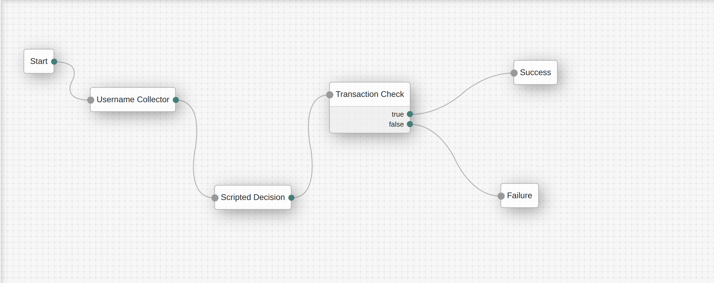

 Step | Node | What it does | Script |
|------|------|--------------|--------|
| 1 | **Start** | Entry point | — |
| 2 | **Username Collector** | Captures the user’s account name | — |
| 3 | **Transaction Collector** | Triggers a mobile scan and stores the returned `transactionID` | [`scripts/collector.js`](scripts/collector.js) |
| 4 | **Transaction Check** | Calls Regula’s `/process` → `/results`, validates `overallStatus` | [`scripts/check.js`](scripts/check.js) |
| 5 | **Success** | Continues login on positive result | — |
| 6 | **Failure** | Aborts login on error | — |

---

## 🔍 How it works – step-by-step

1. **Username input**
   The user types their account name in ForgeRock’s login page.

2. **Mobile document scan**
   ForgeRock renders the *Transaction Collector* node, which prompts the companion mobile app to open Regula DocReader and scan a document.
   The app sends a `transactionID` back to ForgeRock via a hidden callback.

3. **Server-side validation**
   The *Transaction Check* node uses that `transactionID` to

   1. **POST** `/transaction/{id}/process` – start verification.
   2. **GET**  `/transaction/{id}/results?withImages=true` – poll for the outcome.
   3. Parse `ContainerList[0].Status.overallStatus`.
   4. If `overallStatus === 1`, move to **Success**; otherwise go to **Failure**.

4. **Outcome**
   * **Success** – user is authenticated.
   * **Failure** – tree ends and the error reason is stored in `sharedState.regulaError`.

---

## 📂 Repository structure

| Path | Purpose |
|------|---------|
| `scripts/collector.js` | Collects `transactionID` from the hidden callback. |
| `scripts/check.js` | Performs Regula API calls and decides the authentication outcome. |

---

## ⚙️ Configuration notes

* **Shared-state keys**
  * `regulaBaseUrl` – Regula backend (default `use a valid one`).
  * `transactionID` – supplied by the mobile app.
---

